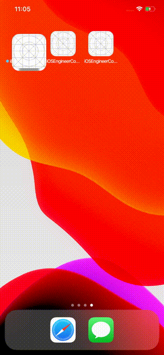

# 株式会社ゆめみ iOS エンジニアコードチェック課題

## 概要

本プロジェクトは株式会社ゆめみ（以下弊社）が、弊社に iOS エンジニアを希望する方に出す課題のベースプロジェクトです。本課題が与えられた方は、下記の説明を詳しく読んだ上で課題を取り組んでください。

新卒／未経験者エンジニアの場合、本リファクタリングの通常課題の代わりに、[新規アプリ作成の特別課題](https://yumemi-ios-junior-engineer-codecheck.app.swift.cloud)も選択できますので、ご自身が得意と感じる方を選んでください。特別課題を選んだ場合、通常課題の取り組みは不要です。新規アプリ作成の課題の説明を詳しく読んだ上で課題を取り組んでください。

## アプリ仕様

本アプリは GitHub のリポジトリーを検索するアプリです。

### 環境

- IDE：基本最新の安定版（本概要更新時点では Xcode 14.1）
- Swift：基本最新の安定版（本概要更新時点では Swift 5.7）
- 開発ターゲット：基本最新の安定版（本概要更新時点では iOS 16.1）
- サードパーティーライブラリーの利用：オープンソースのものに限り制限しない

### 動作

1. 何かしらのキーワードを入力
2. GitHub API（`search/repositories`）でリポジトリーを検索し、結果一覧を概要（リポジトリ名）で表示
3. 特定の結果を選択したら、該当リポジトリの詳細（リポジトリ名、オーナーアイコン、プロジェクト言語、Star 数、Watcher 数、Fork 数、Issue 数）を表示

## 課題取り組み方法

Issues を確認した上、本プロジェクトを [**Duplicate** してください](https://help.github.com/en/github/creating-cloning-and-archiving-repositories/duplicating-a-repository)（Fork しないようにしてください。必要ならプライベートリポジトリーにしても大丈夫です）。今後のコミットは全てご自身のリポジトリーで行ってください。

コードチェックの課題 Issue は全て [`課題`](https://github.com/yumemi/ios-engineer-codecheck/milestone/1) Milestone がついており、難易度に応じて Label が [`初級`](https://github.com/yumemi/ios-engineer-codecheck/issues?q=is%3Aopen+is%3Aissue+label%3A初級+milestone%3A課題)、[`中級`](https://github.com/yumemi/ios-engineer-codecheck/issues?q=is%3Aopen+is%3Aissue+label%3A中級+milestone%3A課題+) と [`ボーナス`](https://github.com/yumemi/ios-engineer-codecheck/issues?q=is%3Aopen+is%3Aissue+label%3Aボーナス+milestone%3A課題+) に分けられています。課題の必須／選択は下記の表とします：

|   | 初級 | 中級 | ボーナス
|--:|:--:|:--:|:--:|
| 新卒／未経験者 | 必須 | 選択 | 選択 |
| 中途／経験者 | 必須 | 必須 | 選択 |

課題 Issueをご自身のリポジトリーにコピーするGitHub Actionsをご用意しております。  
[こちらのWorkflow](./.github/workflows/copy-issues.yml)を[手動でトリガーする](https://docs.github.com/ja/actions/managing-workflow-runs/manually-running-a-workflow)ことでコピーできますのでご活用下さい。

課題が完成したら、リポジトリーのアドレスを教えてください。

## 参考情報

提出された課題の評価ポイントについても詳しく書かれてありますので、ぜひご覧ください。

- [私が（iOS エンジニアの）採用でコードチェックする時何を見ているのか](https://qiita.com/lovee/items/d76c68341ec3e7beb611)
- [CocoaPods の利用手引き](https://qiita.com/ykws/items/b951a2e24ca85013e722)
- [ChatGPT (Model: GPT-4) でコードリファクタリングをやってみる](https://qiita.com/mitsuharu_e/items/213491c668ab75924cfd)

ChatGPTなどAIサービスの利用は禁止しておりません。  
利用にあたって工夫したプロンプトやソースコメント等をご提出頂くと加点評価する場合がございます。 (減点評価はありません)
