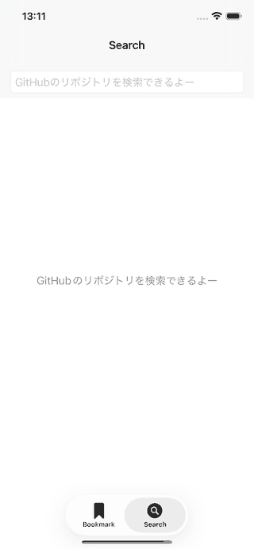

# ゆめみ iOS エンジニアコードチェック課題

## 概要

本プロジェクトはゆめみの iOS エンジニアを希望する方に出す課題のベースプロジェクトです。本課題が与えられた方は、下記の説明を詳しく読んだ上で課題を取り組んでください。

AI コーディングアシスタントの利用は通常の開発作業と同様に自由です。利用の有無にかかわらず評価基準は同じです。課題終了時に [`AI_USAGE.md`](./AI_USAGE.md) を完成させてください。

## アプリ仕様

本アプリは GitHub のリポジトリを検索するアプリです。



> 上の動画は、課題を改善した場合の理想的な動作イメージです。現在の実装の挙動をそのまま示すものではなく、実装方法を指定するものでもありません。

### 環境

- IDE：基本最新の安定版（本概要更新時点では Xcode 27.0）
- Swift：基本最新の安定版（本概要更新時点では Swift 6.4）
- 開発ターゲット：基本最新の安定版（本概要更新時点では iOS 27.0）
- サードパーティーライブラリの利用：オープンソースのものに限り制限しない

### 動作

アプリは **Search** と **Bookmark** の 2 タブで構成されています。

1. Search タブのテキストフィールドにキーワードを入力し、キーボードの Search を押す
2. 検索中はローディングインジケータが表示され、完了すると結果一覧が表示される（各項目にリポジトリ名と主要言語）
3. 結果の項目をタップすると、リポジトリの詳細画面に遷移する（オーナーアバター、フルネーム、主要言語、Star 数、Watcher 数、Fork 数、Open Issue 数）
4. 詳細画面のボタンで、リポジトリをブックマークに追加または削除できる
5. Bookmark タブでは保存済みリポジトリの一覧が表示され、タップすると詳細画面に遷移する
6. Remove を押すと即座に Bookmark から削除されるが、画面は詳細のままで留まり、Add で再登録できる
7. ブックマークはアプリの再起動後も保持される

## 課題取り組み方法

### 1. プロジェクトをコピーする

本プロジェクトを [**Duplicate** してください](https://help.github.com/en/github/creating-cloning-and-archiving-repositories/duplicating-a-repository)（Fork にはしないでください。プライベートリポジトリにしても構いません）。以降の作業は全てご自身のリポジトリで行ってください。

### 2. 課題 Issue を登録する

ご自身のリポジトリの **Actions** 画面から `Import assignment issues` Workflow を手動で実行してください。このリビジョンに対応する課題 Issue、Label、Milestone が登録されます。

> 課題定義は [`.assignment/manifest.json`](./.assignment/manifest.json) と同ディレクトリの Markdown に含まれます。同じ Workflow を再実行しても Issue は重複しません。応募者が編集した既存 Issue は既定では上書きしません。課題定義の内容へ戻す必要がある場合のみに `update_existing` を有効にしてください。

### 3. 課題に取り組む

課題 Issue は全て `課題` Milestone が付いており、難易度に応じて `初級`・`中級`・`ボーナス` の Label で分けられています。選考区分ごとの達成条件は以下の通りです。

| 選考区分 | 初級 | 中級 | ボーナス |
| :------ | :--: | :--: | :------: |
| 新卒・未経験者 | 必須 | 任意 | 任意     |
| 中途・経験者   | 必須 | 必須 | 任意     |

各 Issue の本文に詳細な説明があります。次のルールに従って順次取り組んでください。

- Pull Request ごとに作業ブランチを作成し、`main` ブランチをベースとしてください
- 1 つの Pull Request には、1 つの Issue に関する変更のみを含めてください。1 つの Issue を複数の Pull Request に分けても構いません
- Pull Request の本文に対象 Issue を記載してください
- 対応完了後、Pull Request を `main` ブランチへマージしてください

AI コーディングアシスタントを利用する場合、利用するサービス、モデル、会話数に制限はありません。生成された内容の採用可否をご自身で判断し、コードレビュー、ビルド、テスト、動作確認など必要な検証を行ってください。個人情報、機密情報、認証情報をプロンプトや提出物へ含めないでください。

課題への対応が全て終了したら、プロジェクトを開いている AI に次のプロンプトを一度だけ入力してください。詳細な作成条件は [`AI_USAGE.md`](./AI_USAGE.md) に記載されています。

```text
AI_USAGE.md の指示に従ってレポートを作成してください。
```

AI がファイルを直接編集できない場合は、`AI_USAGE.md` を読み込ませ、生成された Markdown を同ファイルへ手動で転記して構いません。

### 4. 提出する

課題が完成したら、[`AI_USAGE.md`](./AI_USAGE.md) を含むリポジトリのアドレスをお知らせください。AI を利用しなかった場合も、同ファイルの該当する項目にチェックを入れてください。

`AI_USAGE.md` は生成後に事実関係の訂正、機密情報の削除、文章の整理を行って構いません。提出物は要約とし、コード、Git 履歴、テスト結果、面接時の説明と照合するための補助資料として利用します。
